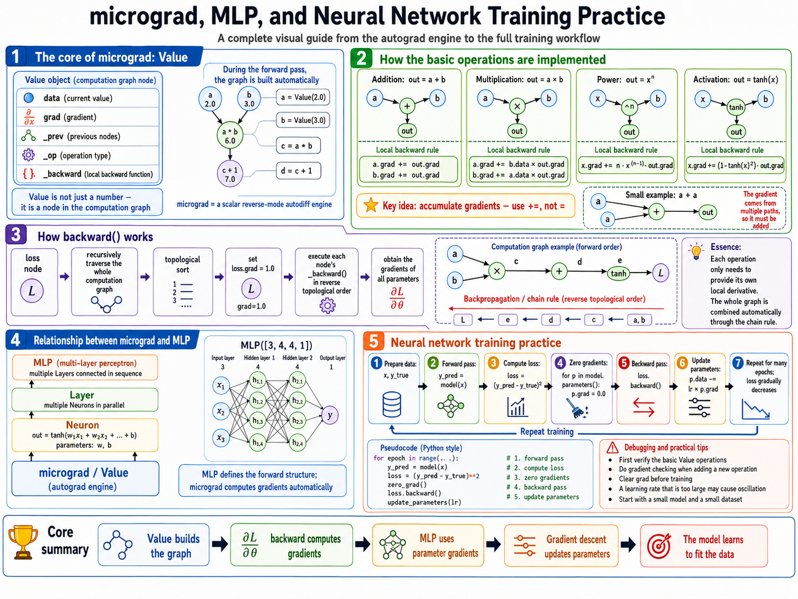

# From micrograd to MLP: Autograd Internals and Neural Network Training Practice

`micrograd` is a minimal automatic differentiation engine. Its value is not performance, but clarity: it exposes the core mechanism behind deep learning frameworks in a form small enough to understand line by line.

At the center are three questions:

1. How is `micrograd` implemented?
2. How does `micrograd` relate to an `MLP`?
3. What exactly happens during neural network training?

---

## Overview Diagram

The following diagram summarizes the relationship between `micrograd`, `MLP`, and the neural network training loop.



---

## 1. The Essence of micrograd

A compact definition:

```text
micrograd = scalar Value computational graph
          + local backward rules
          + topological sort
          + reverse-mode chain rule
```

`micrograd` does not start by implementing a neural network framework. It first implements a tiny autograd engine. Neural network weights, biases, intermediate activations, and the final loss are all represented as `Value` objects.

A `Value` is not just a number. It is a node in a computation graph:

```python
class Value:
    def __init__(self, data, children=(), op=''):
        self.data = data              # current scalar value
        self.grad = 0.0               # dLoss/dThisValue
        self._prev = set(children)    # previous nodes this node depends on
        self._op = op                 # operation that produced this node
        self._backward = lambda: None # local backward function
```

Example:

```python
a = Value(2.0)
b = Value(3.0)
c = a * b
d = c + 1
```

The forward values are:

```text
a = 2.0
b = 3.0
c = a * b = 6.0
d = c + 1 = 7.0
```

But `micrograd` records more than values. It records dependencies:

```text
a ─┐
   ├── (*) ── c ── (+1) ── d
b ─┘
```

This graph is what makes `backward()` possible later.

---

## 2. Forward Computation: Operator Overloading Builds the Graph

The key implementation trick in `micrograd` is this:

> Python operator overloading is used to build the computation graph during the forward pass.

For example:

```python
c = a * b
```

It looks like ordinary multiplication, but internally four things happen:

```text
1. Compute c.data = a.data * b.data
2. Record c._prev = {a, b}
3. Record c._op = '*'
4. Attach the multiplication-specific _backward() function to c
```

### 2.1 Addition

```python
def __add__(self, other):
    other = other if isinstance(other, Value) else Value(other)
    out = Value(self.data + other.data, (self, other), '+')

    def _backward():
        self.grad += out.grad
        other.grad += out.grad

    out._backward = _backward
    return out
```

Mathematically:

```text
out = a + b
∂out/∂a = 1
∂out/∂b = 1
```

Therefore:

```text
∂L/∂a += ∂L/∂out × 1
∂L/∂b += ∂L/∂out × 1
```

In code:

```python
self.grad += out.grad
other.grad += out.grad
```

The `+=` is mandatory. It must not be replaced by `=`.

Reason: the same node can affect the loss through multiple paths, and its final gradient must be the sum of all contributions.

Example:

```python
a = Value(2.0)
b = a + a
```

Mathematically:

```text
b = a + a = 2a
∂b/∂a = 2
```

If `_backward()` used assignment instead of accumulation, the second path would overwrite the first path and the gradient would be wrong.

---

### 2.2 Multiplication

```python
def __mul__(self, other):
    other = other if isinstance(other, Value) else Value(other)
    out = Value(self.data * other.data, (self, other), '*')

    def _backward():
        self.grad += other.data * out.grad
        other.grad += self.data * out.grad

    out._backward = _backward
    return out
```

Mathematically:

```text
out = a × b
∂out/∂a = b
∂out/∂b = a
```

Therefore:

```text
∂L/∂a += ∂L/∂out × b
∂L/∂b += ∂L/∂out × a
```

In code:

```python
self.grad += other.data * out.grad
other.grad += self.data * out.grad
```

---

### 2.3 Power

```python
def __pow__(self, n):
    assert isinstance(n, (int, float))
    out = Value(self.data ** n, (self,), f'**{n}')

    def _backward():
        self.grad += n * (self.data ** (n - 1)) * out.grad

    out._backward = _backward
    return out
```

Mathematically:

```text
out = x^n
∂out/∂x = n × x^(n-1)
```

Therefore:

```text
∂L/∂x += ∂L/∂out × n × x^(n-1)
```

---

### 2.4 tanh Activation

```python
import math

def tanh(self):
    t = math.tanh(self.data)
    out = Value(t, (self,), 'tanh')

    def _backward():
        self.grad += (1 - t ** 2) * out.grad

    out._backward = _backward
    return out
```

Mathematically:

```text
out = tanh(x)
∂out/∂x = 1 - tanh(x)^2
```

Therefore:

```text
∂L/∂x += ∂L/∂out × (1 - tanh(x)^2)
```

---

## 3. How `backward()` Works

`loss.backward()` is the main entry point of the autograd engine.

It performs three operations:

```text
1. Starting from the loss node, recursively traverse the whole computation graph
2. Topologically sort the graph
3. Execute each node's _backward() function in reverse topological order
```

A typical implementation:

```python
def backward(self):
    topo = []
    visited = set()

    def build_topo(v):
        if v not in visited:
            visited.add(v)
            for child in v._prev:
                build_topo(child)
            topo.append(v)

    build_topo(self)

    self.grad = 1.0

    for v in reversed(topo):
        v._backward()
```

There are two important details.

### 3.1 Why `loss.grad = 1.0`?

Backpropagation starts from the loss itself:

```text
∂L/∂L = 1
```

So the first gradient seed is:

```python
self.grad = 1.0
```

This is the starting point for the entire backward pass.

### 3.2 Why Topological Sorting Is Required

Assume the graph is:

```text
a ─┐
   ├── c ── d ── loss
b ─┘
```

The backward order must be:

```text
loss → d → c → a,b
```

You cannot run `c._backward()` before `c.grad` has received all contributions from later nodes.

Topological sorting guarantees:

```text
When a node executes _backward(), the gradient it receives from downstream nodes is already available.
```

---

## 4. Relationship Between micrograd and MLP

The relationship is direct:

```text
micrograd is the autograd engine.
MLP is the neural network structure built on top of micrograd.Value.
```

PyTorch analogy:

```text
micrograd.Value      ≈ torch.Tensor + autograd
Neuron / Layer / MLP ≈ torch.nn.Module
loss.backward()      ≈ PyTorch loss.backward()
```

Important distinction:

```text
micrograd is scalar-level.
PyTorch is tensor-level and backed by optimized C++/CUDA kernels.
```

---

## 5. Neuron: Implementing One Neural Unit with Value

A neuron computes:

```text
out = tanh(w1x1 + w2x2 + ... + wnxn + b)
```

Implementation:

```python
class Neuron:
    def __init__(self, n_inputs):
        self.w = [Value(random.uniform(-1, 1)) for _ in range(n_inputs)]
        self.b = Value(0.0)

    def __call__(self, x):
        act = sum((wi * xi for wi, xi in zip(self.w, x)), self.b)
        return act.tanh()

    def parameters(self):
        return self.w + [self.b]
```

The key point is that each operation is a `Value` operation:

```python
wi * xi
```

calls `Value.__mul__()`.

```python
sum(...)
```

calls `Value.__add__()`.

```python
act.tanh()
```

calls `Value.tanh()`.

Therefore, one neuron automatically builds this graph during the forward pass:

```text
w1 ─┐
    ├── w1*x1 ─┐
x1 ─┘          │
               │
w2 ─┐          ├── + ── +b ── tanh ── out
    ├── w2*x2 ─┤
x2 ─┘          │
               │
w3 ─┐          │
    ├── w3*x3 ─┘
x3 ─┘
```

`Neuron` itself does not need a custom `backward()` method. As long as the underlying `Value` backward rules are correct, gradients for the neuron parameters are obtained automatically.

---

## 6. Layer: Multiple Neurons in Parallel

```python
class Layer:
    def __init__(self, n_inputs, n_outputs):
        self.neurons = [Neuron(n_inputs) for _ in range(n_outputs)]

    def __call__(self, x):
        return [n(x) for n in self.neurons]

    def parameters(self):
        return [p for n in self.neurons for p in n.parameters()]
```

Example:

```python
layer = Layer(3, 4)
```

This means:

```text
input dimension: 3
output dimension: 4
```

The layer contains 4 neurons, and each neuron receives 3 inputs.

The output is a list of 4 `Value` objects:

```python
[h1, h2, h3, h4]
```

---

## 7. MLP: Multiple Layers in Sequence

```python
class MLP:
    def __init__(self, sizes):
        self.layers = [
            Layer(sizes[i], sizes[i + 1])
            for i in range(len(sizes) - 1)
        ]

    def __call__(self, x):
        for layer in self.layers:
            x = layer(x)
        return x[0] if len(x) == 1 else x

    def parameters(self):
        return [p for layer in self.layers for p in layer.parameters()]
```

Example:

```python
model = MLP([3, 4, 4, 1])
```

This represents:

```text
input layer: 3 inputs
hidden layer 1: 4 neurons
hidden layer 2: 4 neurons
output layer: 1 neuron
```

Structure:

```text
x = [x1, x2, x3]
        ↓
Layer(3 → 4)
        ↓
Layer(4 → 4)
        ↓
Layer(4 → 1)
        ↓
y_pred
```

The key separation of responsibilities is:

```text
MLP defines the forward computation structure.
micrograd.Value computes gradients automatically.
```

---

## 8. Neural Network Training Practice

A complete training loop contains five core steps:

```text
1. forward
2. compute loss
3. zero grad
4. backward
5. update parameters
```

Complete example:

```python
import random

random.seed(42)

model = MLP([3, 4, 4, 1])

xs = [
    [2.0, 3.0, -1.0],
    [3.0, -1.0, 0.5],
    [0.5, 1.0, 1.0],
    [1.0, 1.0, -1.0],
]

ys = [1.0, -1.0, -1.0, 1.0]

lr = 0.05

for epoch in range(100):
    # 1. forward
    ypred = [model(x) for x in xs]

    # 2. compute loss
    loss = sum((yout - ygt) ** 2 for ygt, yout in zip(ys, ypred))

    # 3. zero grad
    for p in model.parameters():
        p.grad = 0.0

    # 4. backward
    loss.backward()

    # 5. update parameters
    for p in model.parameters():
        p.data -= lr * p.grad

    if epoch % 10 == 0:
        print(epoch, loss.data)
```

---

## 9. What Happens Inside the Training Loop

### 9.1 Forward

```python
ypred = [model(x) for x in xs]
```

Each sample passes through:

```text
x → Layer1 → Layer2 → Layer3 → y_pred
```

At the same time, `Value` records every operation and dynamically builds the computation graph.

---

### 9.2 Compute Loss

```python
loss = sum((yout - ygt) ** 2 for ygt, yout in zip(ys, ypred))
```

Per-sample error:

```text
error = y_pred - y_true
```

Squared loss:

```text
loss_i = error^2
```

Total loss:

```text
loss = loss_1 + loss_2 + ... + loss_n
```

Since `y_pred` is a `Value`, `loss` is also a `Value`. At this point, the graph connects all model parameters to the final loss.

---

### 9.3 Zero Grad

```python
for p in model.parameters():
    p.grad = 0.0
```

This step is mandatory because every `_backward()` implementation uses accumulation:

```python
p.grad += ...
```

Without zeroing gradients, gradients from the second epoch would be added to gradients from the first epoch, corrupting parameter updates.

---

### 9.4 Backward

```python
loss.backward()
```

Starting from the loss node, `micrograd` executes `_backward()` for every graph node in reverse topological order.

Eventually every trainable parameter receives:

```text
p.grad = ∂loss/∂p
```

Examples:

```text
w1.grad = ∂loss/∂w1
b.grad  = ∂loss/∂b
```

---

### 9.5 Parameter Update

```python
p.data -= lr * p.grad
```

This is gradient descent:

```text
new_param = old_param - learning_rate × gradient
```

If:

```text
p.grad > 0
```

increasing `p` would increase the loss, so the update decreases `p`.

If:

```text
p.grad < 0
```

increasing `p` would decrease the loss, so the update increases `p`.

---

## 10. Gradient Checking: Required When Adding New Operations

When implementing new operations, such as:

```python
def log(self):
    ...

def exp(self):
    ...

def relu(self):
    ...
```

you must implement the corresponding `_backward()` rule. If that rule is wrong, training may still run, but parameter updates will move in the wrong direction.

Gradient checking means:

```text
Use numerical finite differences to verify whether the gradient from backward() is correct.
```

Finite-difference formula:

```text
∂L/∂p ≈ [L(p + h) - L(p - h)] / (2h)
```

Example implementation:

```python
def gradient_check(model, loss_fn, eps=1e-6, tol=1e-4):
    # analytic gradient
    loss = loss_fn()

    for p in model.parameters():
        p.grad = 0.0

    loss.backward()

    # numerical gradient
    for i, p in enumerate(model.parameters()):
        old_data = p.data

        p.data = old_data + eps
        loss_plus = loss_fn().data

        p.data = old_data - eps
        loss_minus = loss_fn().data

        p.data = old_data

        num_grad = (loss_plus - loss_minus) / (2 * eps)
        ana_grad = p.grad
        diff = abs(num_grad - ana_grad)

        print(
            f"param {i}: "
            f"analytic={ana_grad:.8f}, "
            f"numerical={num_grad:.8f}, "
            f"diff={diff:.8e}"
        )

        if diff > tol:
            print(f"Gradient check failed at param {i}")
```

Practical rule:

```text
When adding a new operation, run gradient checking on a small model and small inputs.
Do not run gradient checking during normal training; it is slow.
```

---

## 11. Common Bugs and Debugging Strategy

### 11.1 Forgetting to Clear Gradients

Buggy code:

```python
loss.backward()
for p in model.parameters():
    p.data -= lr * p.grad
```

Missing step:

```python
for p in model.parameters():
    p.grad = 0.0
```

Result:

```text
Gradients accumulate across epochs. The loss may oscillate or explode.
```

---

### 11.2 Using `=` Instead of `+=` in `_backward()`

Wrong:

```python
self.grad = out.grad
```

Correct:

```python
self.grad += out.grad
```

Reason:

```text
The same Value may affect the loss through multiple paths.
Total gradient = sum of contributions from all paths.
```

---

### 11.3 Incorrect Topological Order

Without topological sorting, a node may execute `_backward()` before it has received all downstream gradient contributions.

Result:

```text
The final gradient may be incomplete.
```

---

### 11.4 Learning Rate Too Large

For example:

```python
lr = 1.0
```

This may cause:

```text
loss increases instead of decreasing
parameters oscillate
tanh saturates
gradients vanish or explode
```

A safer starting range for this small micrograd example is often:

```text
0.01 ~ 0.1
```

---

### 11.5 Skipping Basic Operation Verification

Recommended validation order:

```text
1. Verify Value add / mul / pow / tanh
2. Verify a single Neuron
3. Verify one Layer
4. Verify the full MLP
```

Do not start debugging with a complex network. It makes fault isolation much harder.

---

## 12. Minimal Validation Path

### 12.1 Verify `Value`

```python
a = Value(2.0)
b = Value(3.0)
c = a * b + a
c.backward()

print(a.grad)
print(b.grad)
```

Mathematically:

```text
c = a*b + a
∂c/∂a = b + 1 = 4
∂c/∂b = a = 2
```

Expected result:

```text
a.grad ≈ 4
b.grad ≈ 2
```

---

### 12.2 Verify a Single Neuron

```python
n = Neuron(3)
x = [1.0, 2.0, 3.0]

out = n(x)
loss = (out - 1.0) ** 2

for p in n.parameters():
    p.grad = 0.0

loss.backward()

for p in n.parameters():
    print(p)
```

Goal: confirm that every `w` and `b` receives a reasonable gradient.

---

### 12.3 Verify the Full MLP

```python
model = MLP([3, 4, 4, 1])
out = model([1.0, 2.0, 3.0])
print(out)
```

Then connect the output to a loss function and training loop, and verify that the loss decreases.

---

## 13. Final Summary

The whole system can be compressed into this pipeline:

```text
Value builds the graph
    ↓
loss.backward() performs reverse topological propagation
    ↓
each parameter receives grad
    ↓
p.data -= lr * p.grad
    ↓
the model gradually fits the training data
```

The relationship between `micrograd` and `MLP` is:

```text
micrograd.Value provides automatic differentiation.
Neuron / Layer / MLP organize forward computation using Value.
The training loop connects forward, loss, backward, and update.
```

The most important point:

```text
An MLP does not learn by itself.
It learns because:
1. loss.backward() computes how each parameter affects the loss.
2. p.data -= lr * p.grad updates parameters in the negative-gradient direction.
```

This is also the core idea behind larger deep learning frameworks such as PyTorch and TensorFlow, implemented at much larger scale and much higher performance.
